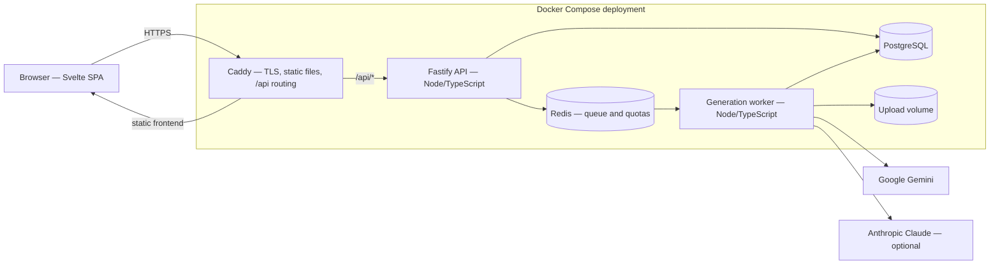
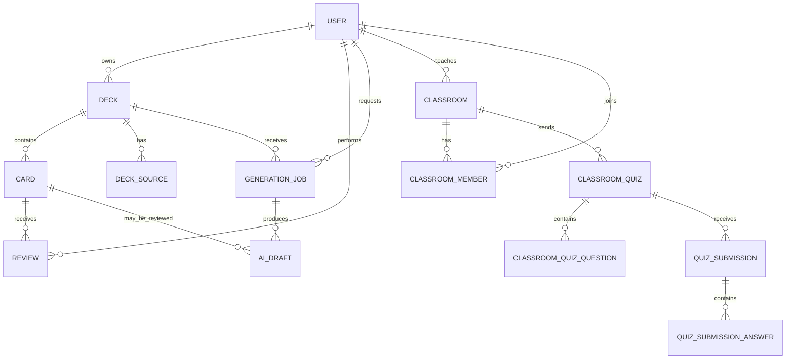

# Flashcards — current system design

This document describes the implementation in the repository as of 21 August 2026. It is intentionally a current-state design, not a list of future intentions.

## 1. Scope and constraints

- **Audience:** Imperial students, teachers, and administrators. Sign-up is restricted to the domains in `ALLOWED_EMAIL_DOMAINS` (`ic.ac.uk,imperial.ac.uk` by default).
- **Scale:** a departmental application serving hundreds to low thousands of users, with heavier use near exams.
- **Deployment:** a modular monolith split into an HTTP API and a background worker, backed by PostgreSQL and Redis and fronted by Caddy.
- **AI cost and reliability:** AI calls are quota-controlled, asynchronous where appropriate, and provider-configurable. Gemini is required for PDF OCR; Claude is optional and Gemini is the fallback for generation and grading.

## 2. Runtime architecture

In local development, `infra/docker-compose.dev.yml` starts only PostgreSQL and Redis. The frontend, API, and worker run from the npm workspaces. In the production-like Compose file, Caddy builds and serves the frontend, while the backend and worker use separate containers.

### Components

| Component | Responsibility |
|---|---|
| Frontend SPA | Authentication, student decks, card editing, Study, Quiz, Self-check, AI review, classrooms, admin screens, and onboarding guidance |
| Caddy | TLS termination, static frontend serving, SPA fallback, and `/api/*` reverse proxying |
| Fastify API | Authentication, authorization, CRUD, scheduling, quiz setup/submission, AI job creation, export, and admin operations |
| Generation worker | PDF extraction/OCR, text and URL drafting, deck review, AI grading, and distractor generation |
| PostgreSQL | Users, decks, source material, cards, AI drafts, study reviews, classrooms, quizzes, submissions, and quota overrides |
| Redis/BullMQ | Generation job queue and daily usage counters |
| Upload volume | Retained PDF sources used to ground later deck review; paths are configured with `UPLOAD_DIR` |

## 3. Frontend

The browser application is a client-rendered Svelte SPA using TypeScript, Vite, and hash-based routing. API response types are shared through the `shared` workspace.

### Main screens

- **Deck library:** create, open, and delete student decks; view card counts, due cards, and attention indicators.
- **Add cards:** create cards manually, paste study text, upload a PDF, or provide a public URL. Manual cards support tags and a quiz-inclusion choice.
- **AI review:** inspect generated or reviewed drafts and accept, accept all, edit, or discard them before they change the deck.
- **Deck detail:** search and filter the question bank by text, tag, or difficulty; edit/delete cards; launch practice modes; export JSON or Anki.
- **Study:** review due cards with Again/Hard/Good/Easy outcomes, interval previews, configurable settings, and an All done retirement action.
- **Quiz:** create self-study multiple-choice, fill-in-the-blank, or mixed sessions with optional difficulty and hard-question selection.
- **Self-check:** submit a typed answer for AI feedback, a score, missing points, and the reference answer.
- **Classwork:** students join classrooms with a code, take assigned quizzes, and view submitted scores.
- **Teacher dashboard/classroom:** teachers manage classrooms, quiz decks, question sources, previews, timers, points, and scores.
- **Admin:** administrators approve, reject, deactivate, reactivate, and assign roles to users; inspect decks; and set per-user quota overrides.

KaTeX rendering is used for card, question, answer, and feedback content containing supported LaTeX-style delimiters.

## 4. Backend and API

The backend is a Fastify modular monolith. Authorization is enforced server-side with `requireUser`, `requireStudent`, `requireTeacher`, and `requireAdmin` guards; frontend route visibility is only a convenience.

The main API groups are:

| Area | Representative routes |
|---|---|
| Auth | `POST /api/auth/signup`, `POST /api/auth/login`, `GET /api/auth/me`, `POST /api/auth/logout` |
| Decks/cards | `GET/POST /api/decks`, `GET/PATCH/DELETE /api/decks/:id`, `GET/POST /api/decks/:id/cards`, `PATCH/DELETE /api/decks/:id/cards/:cardId` |
| AI jobs | `POST /api/decks/:id/generate`, `POST /api/decks/:id/generate-text`, `POST /api/decks/:id/generate-url`, `POST /api/decks/:id/review`, `GET /api/generation-jobs/:id` |
| Draft decisions | `POST /api/generation-jobs/:id/drafts/accept-all`, `POST .../drafts/:draftId/accept`, `POST .../drafts/:draftId/discard` |
| Study | `GET /api/decks/:id/study/next`, `POST /api/reviews`, `GET /api/account/study-settings`, `PUT /api/account/study-settings` |
| Self-study quiz | `GET /api/decks/:id/quiz`, `POST /api/self-check/grade` |
| Export | `GET /api/decks/:id/export/json`, `GET /api/decks/:id/export/anki` |
| Classrooms | `/api/classrooms/*` and `/api/classroom-quizzes/*` for creation, joining, configuration, scores, and submissions |
| Admin | `/api/admin/*` for user lifecycle, deck inspection, and quota overrides |
| Health | `GET /api/health` returns `{ "ok": true }` |

## 5. AI pipeline and guardrails

1. The API validates ownership, input size, source type, and the user's quota before creating a job.
2. PDF jobs store the source and pass it through the worker for extraction/OCR. Text and URL jobs use their supplied content.
3. The worker asks the configured provider for structured draft cards, including source citations and estimated difficulty where available.
4. Drafts are stored in `AiDraft`, never directly in `Card`.
5. The user reviews each draft. Accepting creates a new card or applies a reviewed change to the original card; discarding leaves the deck unchanged.

The provider selection is configurable through `ANTHROPIC_*` and `GEMINI_*` environment variables. Gemini is the required PDF OCR provider. Claude is preferred when its key is present for configured generation/grading tasks; Gemini is used as fallback.

Daily usage buckets include generation, grading, deck review, PDF pages, generated cards, and MCQ distractors. Defaults are configured in the environment and can be overridden for individual users by an administrator.

## 6. Data model

The Prisma schema is the source of truth. Its main relationships are:

Important invariants:

- A card belongs to one deck, and deck access is checked against the authenticated owner or an authorized admin path.
- AI drafts are pending until a user decision resolves them.
- Study reviews are per user/card and store the outcome and next due time.
- A classroom quiz has one submission per student (`quizId + studentId` is unique).
- A card can be retired from Study without deleting it from the deck.

Prisma migrations are stored in `backend/prisma/migrations` and are applied automatically by the production backend container on startup.

## 7. Authentication and authorization

The implemented flow is email/password, not Microsoft Entra OAuth. Sign-up accepts only configured domains, hashes passwords with scrypt, and creates new student/teacher accounts as `pending`. An administrator must approve them before login. The optional `ADMIN_EMAIL`, `ADMIN_PASSWORD`, and `ADMIN_NAME` variables bootstrap or resynchronise an approved admin account at backend startup.

Sessions are signed, HTTP-only cookies. No access token is stored in `localStorage`. The optional `TEST_LOGIN_SECRET`/`TEST_LOGIN_EMAIL` pair enables a development-only login endpoint and must never be enabled publicly.

## 8. Deployment and operations

The intended deployment is one Linux host running Docker Compose services for Caddy, backend, worker, PostgreSQL, and Redis. Caddy obtains the certificate for `APP_DOMAIN`; backend startup runs `prisma migrate deploy` before serving requests.

Production operations still require manual ownership of:

- `.env` secret management;
- PostgreSQL backups and restore testing;
- log retention and disk monitoring;
- external health checks; and
- `git pull` followed by `docker compose up -d --build` for updates.

See [infra/README.md](./infra/README.md) for the concrete commands. Automated CI/CD, Entra OAuth, and scheduled off-box backups are not part of the current repository.

## 9. Security and product follow-ups

- Test AI imports against representative lecture PDFs and verify source grounding.
- Import an `.apkg` file into the pilot's target Anki Desktop release.
- Replace the browser-native deck deletion confirmation with an accessible in-app confirmation.
- Decide whether the pilot needs cross-deck Study, actionable forgotten-card filtering, or per-deck study intervals.
- Confirm retention and access requirements for stored lecture PDFs with the department.
