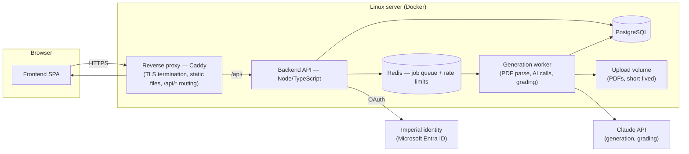
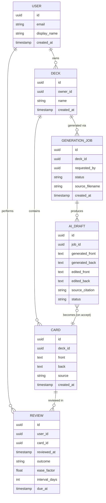

# Flashcard Activity — Fullstack System Design

## 1. Scope and constraints

- **Audience**: Imperial students and staff, identified by `@ic.ac.uk` / `@imperial.ac.uk` email — every survey respondent used one, and it's the natural trust boundary for who gets an account.
- **Scale**: a departmental tool, not a public product — hundreds to low thousands of users, bursty around exam periods. This rules out microservices, Kubernetes, and multi-region infrastructure; a single well-run Linux server carries this comfortably. 
- **Money-sensitive calls**: PDF-based generation, gap-filling suggestions, and typed-answer grading all call an LLM per request(I plan to try with ocr unlimited which is free of use with certain range). Claude usage is also balanced where I will trade-off between sonnet and haiku.

## 2. Architecture overview



One origin, one TLS certificate: the proxy serves the built frontend directly and forwards `/api/*` to the backend, so the browser never talks cross-origin and CORS configuration mostly disappears.

### Components

| Component | Responsibility |
|---|---|
| Frontend SPA | Deck library, card builder, study/quiz/self-check modes, AI review (diff) screen |
| Reverse proxy | TLS, HTTP→HTTPS redirect, static asset serving, request routing |
| Backend API | Auth, decks/cards CRUD, SRS scheduling, review submission, export, job creation |
| Generation worker | PDF text extraction, prompts to Claude, staged AI-draft writes, answer grading |
| PostgreSQL | Users, decks, cards, review history, generation jobs and drafts |
| Redis | Job queue between API and worker; per-user rate-limit counters |
| Upload volume | Raw PDFs, deleted once a generation job's drafts are resolved |

## 3. Frontend design

**Shape**: a client-rendered SPA, not server-rendered. Everything lives behind login, so there's no SEO reason to render on the server, and a pure SPA keeps the backend a clean API with no templating concerns.

**Stack**: Vite + Svelte, TypeScript. Reasoning: the current app's whole ethos is "self-contained and light" — a full React+Next stack would fight that. Svelte compiles away its runtime, keeps bundle size close to the vanilla-JS original, and is expressive enough for the state this app now needs (auth state, async job polling, per-card diff review) without a heavy component-framework tax. Plain vanilla JS, which worked for one file, stops scaling once there's routing, auth, and multi-screen async flows.

**Screens** (each maps to a README feature group):

- **Deck library** — grid of the user's decks, card count, due-for-review count, forgotten-cards indicator per deck.
- **Card builder** — manual entry and bulk paste/upload, unchanged in spirit from today.
- **PDF import** — drag-and-drop upload, job-status view (queued → extracting → generating → ready), hands off to the AI review screen.
- **AI review (diff)** — the guardrail surface: each AI-touched card shown as before/after, with per-card Accept / Edit / Discard. No AI output reaches a deck without passing through this screen.
- **Study mode** — flip cards, SRS-scheduled ("due today: 12"), replaces manual Got it/Review again with real interval scheduling under the hood while keeping the same buttons as the affordance.
- **Quiz mode** — unchanged MCQ format from the current build.
- **Self-check mode** — typed answer, submitted to the backend for AI grading, returns a score and what was missing.
- **Export** — one action, produces an Anki-compatible file for the current deck.

**State/data**: a thin API client with typed responses (see §6, shared types); no heavy global-state library needed at this scale — page-local state plus a small auth/session store covers it.

**Async jobs**: the PDF-import and grading calls are not instant. The frontend polls a job-status endpoint (2–3s interval) rather than holding a request open; simplest thing that works reliably through a proxy. Server-sent events are a reasonable later upgrade, not a launch requirement.

## 4. Backend design

**Stack**: Node.js + TypeScript, Fastify. Reasoning: same language as the frontend, so request/response types can be shared instead of duplicated (see §6); Fastify's built-in schema validation gives request validation "for free" at the framework level rather than as bolted-on middleware, and its overhead is low enough to be a non-issue at this scale. Express is the safer, more-documented fallback if the team prefers it — the design doesn't depend on which one is picked.

**Structure**: a modular monolith, not microservices — one deployable backend, internally organized by domain (`auth`, `decks`, `cards`, `generation`, `study`, `export`), each module owning its routes, validation, and DB access. This gets the code-organization benefit of separation without the operational cost of running and coordinating multiple services for a tool this size.

**API surface** (representative, not exhaustive):

| Route | Purpose |
|---|---|
| `POST /api/auth/callback` | Complete Microsoft OAuth login |
| `GET /api/decks` | List the current user's decks |
| `POST /api/decks` / `PATCH /api/decks/:id` | Create/edit a deck |
| `GET/POST /api/decks/:id/cards` | List/add cards directly |
| `POST /api/decks/:id/generate` | Upload a PDF, enqueue a generation job |
| `GET /api/generation-jobs/:id` | Poll job status and resulting AI drafts |
| `POST /api/generation-jobs/:id/drafts/:draftId/accept` | Accept (optionally edited) draft into the deck |
| `POST /api/generation-jobs/:id/drafts/:draftId/discard` | Drop a draft |
| `GET /api/decks/:id/study/next` | Next due card per the SRS schedule |
| `POST /api/reviews` | Submit a study outcome, updates SRS state |
| `POST /api/self-check/grade` | Grade a typed answer against a card |
| `GET /api/decks/:id/export/anki` | Download an Anki-compatible export |

**Generation worker**: a separate process from the API (same codebase, different entrypoint), consuming jobs off Redis. Keeping it out of the request/response cycle means an AI call taking 10–30 seconds never ties up an API worker thread or a browser's open connection, and it's the natural place to enforce per-user generation quotas before spending on a Claude call.

## 5. AI integration and guardrails

**Provider split**: PDF OCR/transcription runs on Gemini 2.5 Flash Lite (cheap, generous free tier for the slide-transcription step), producing slide-marked plain text (`=== Slide N ===`). That text is then handed to Claude (Anthropic) for the actual card drafting — Claude's outputs can be constrained to cite the source slide a card was drawn from, which is what makes the guardrails below enforceable rather than aspirational. Splitting the pipeline this way keeps the expensive, quality-sensitive step (grounded generation) on Claude while the high-volume, lower-stakes step (OCR) runs on the cheaper model.

**The non-negotiable rule, architecturally enforced, not just prompted**: AI output is never written to the `cards` table. It is written to a separate `ai_drafts` table, tied to a `generation_jobs` row, and only a user action (`.../accept`) copies a draft into `cards` — at which point the draft is marked resolved. This is a schema-level guarantee, not a UI convention that a future feature could bypass.

Mapped to the requirements the survey produced ([README §2](./README.md#2-ai-assisted-generation--with-guardrails)):

| Requirement | How the architecture enforces it |
|---|---|
| No hallucinated facts | Generation prompt requires each draft card cite the source slide span; drafts without a grounded citation are flagged, not silently accepted |
| Match the course's voice | Prompt is built from the deck's own existing cards as style reference, not a generic template |
| Stay concise | Length constraint enforced in the generation prompt and re-checked before a draft is stored |
| Render formulae | Draft text preserves LaTeX-style math markup; frontend renders it with KaTeX in both the diff view and study/quiz views |
| Visible diffs | `ai_drafts` stores both the generated text and (on edit) the user's edited version, so the diff view has real before/after data, not a reconstruction |
| Suggest, don't overwrite | Gap-filling on an existing deck creates new `ai_drafts` rows against that deck; it never modifies existing `cards` rows directly |

**Cost control**: per-user daily quotas on generation jobs and grading calls, enforced in Redis before a job is enqueued or a grading call is made. Budget ownership (who sets the quota, who watches spend) is an open decision for the team, not something this design can resolve — flagged in §11.

## 6. Data model



`REVIEW` carries the SM-2-style spaced-repetition state (ease factor, interval, due date) per user per card — this is what makes "due today" in the deck library and the study-mode queue a plain query rather than a client-side approximation.

**ORM/migrations**: Prisma, chosen for schema-as-code migrations and generating TypeScript types straight from the schema — those types are the same ones the shared package (below) re-exports to the frontend, so a schema change surfaces as a type error in the client rather than a runtime mismatch.

**Monorepo layout**:

```
/frontend    — Svelte + Vite SPA
/backend     — Fastify API + generation worker
/shared      — TypeScript types shared by both (API contracts, entity shapes)
/infra       — docker-compose, Caddy config, deploy scripts, Prisma schema
```

## 7. Authentication & identity

**Primary**: Microsoft Entra ID (Azure AD) OAuth. Imperial already runs on Microsoft 365 — the survey itself was distributed as a Microsoft Form — so students already have the account this would use for sign-in; no new password, no separate credential to leak or reset.

**Fallback, in use now since Entra ID app registration isn't feasible for the team to obtain**: email + password accounts, restricted at signup to `@ic.ac.uk` / `@imperial.ac.uk` addresses (passwords are app-specific, hashed with scrypt — not the user's actual Microsoft/Imperial password). Requires no institutional approval and can ship immediately; treat it as a stopgap, not the target state.

Either way, session handling is a signed, HTTP-only cookie scoped to the single origin from §2 — no token stored in `localStorage`, nothing for a frontend XSS bug to steal directly.

## 8. Deployment topology (Linux server)

**Target**: a single Ubuntu LTS VM, everything containerized via Docker Compose. Services: `proxy` (Caddy), `frontend` (static build, served by `proxy`), `backend` (API), `worker` (generation jobs), `db` (Postgres), `redis`. A `systemd` unit runs `docker compose up -d` on boot so the stack survives a server restart without manual intervention.

**TLS**: Caddy over Nginx+certbot — Caddy obtains and renews Let's Encrypt certificates automatically from a two-line config block, which matters for a tool that won't have dedicated ops staff watching certificate expiry.

**Storage**:
- Postgres data on a Docker-managed volume, backed up nightly (`pg_dump`, compressed, shipped off-box — Imperial-provided storage or an object-storage bucket, retained on a rolling window, e.g. 14 days).
- Uploaded PDFs on a separate volume, **deleted once their generation job's drafts are all resolved** (accepted or discarded) — there's no product reason to retain a student's lecture slides once the cards are drawn from them, and not retaining them removes a whole category of data-handling risk.

**Environments**: local Docker Compose for development (same compose file, different `.env`), one production server. A staging environment is worth adding once the AI-generation flow is built and needs testing against real Claude calls without touching production quotas — not needed for the initial deploy.

## 9. CI/CD

GitHub Actions on push to `main`:

1. Install, typecheck, lint, run backend + frontend test suites.
2. Build the frontend static bundle and the backend Docker image; push the image to GitHub Container Registry.
3. SSH into the server and run a deploy script: pull the new image, `docker compose up -d`, run any pending Prisma migrations, health-check the `/api/health` endpoint, and only then remove the previous image tag.

Kept deliberately simple — one server, one deploy target — rather than a multi-stage pipeline the team would have to maintain more than they'd use.

## 10. Operations

- **Secrets**: a `.env` file on the server (Claude API key, DB credentials, Entra ID client secret), never committed; injected into containers via Docker Compose's `env_file`. GitHub Actions holds the same secrets for CI, injected at deploy time over SSH — no secrets manager needed at this scale.
- **Rate limiting**: per-user quotas on generation and grading (§5) plus a general per-IP request limit at the Caddy layer against basic abuse.
- **Logging**: container stdout/stderr, captured by Docker's logging driver with rotation configured (avoid an unbounded log file being the thing that fills the disk).
- **Monitoring**: a `/api/health` endpoint checked by an external uptime pinger (e.g. a free-tier status-check service) — enough to know the server is down before a student reports it; a full metrics/alerting stack (Prometheus/Grafana) is more operational overhead than this deployment's scale justifies.
- **File validation**: uploaded PDFs capped by size (e.g. 20MB) and MIME-type checked server-side before entering the generation queue, so an oversized or malformed upload fails fast rather than tying up the worker.

## 11. Open questions for the team

These are decisions this design deliberately leaves to the people who'll own them, not gaps in the design itself:

- **Entra ID app registration** — does the team have (or can it get) the Imperial IT approval needed to register the app for SSO? Launch is starting with the email + password fallback since this wasn't available.
- **Claude API budget ownership** — who sets and monitors the per-user generation/grading quotas from §5, and what's the ceiling before it needs a conversation?
- **Server hosting** — is the Linux VM Imperial-provided (departmental infrastructure) or an external host (e.g. a cloud VM) procured by the team? Affects who holds root and who's paged if it goes down.
- **PDF retention exception** — confirm the "delete after drafts resolved" policy in §8 against any module/copyright-material handling guidance the department already has for lecture slides.
